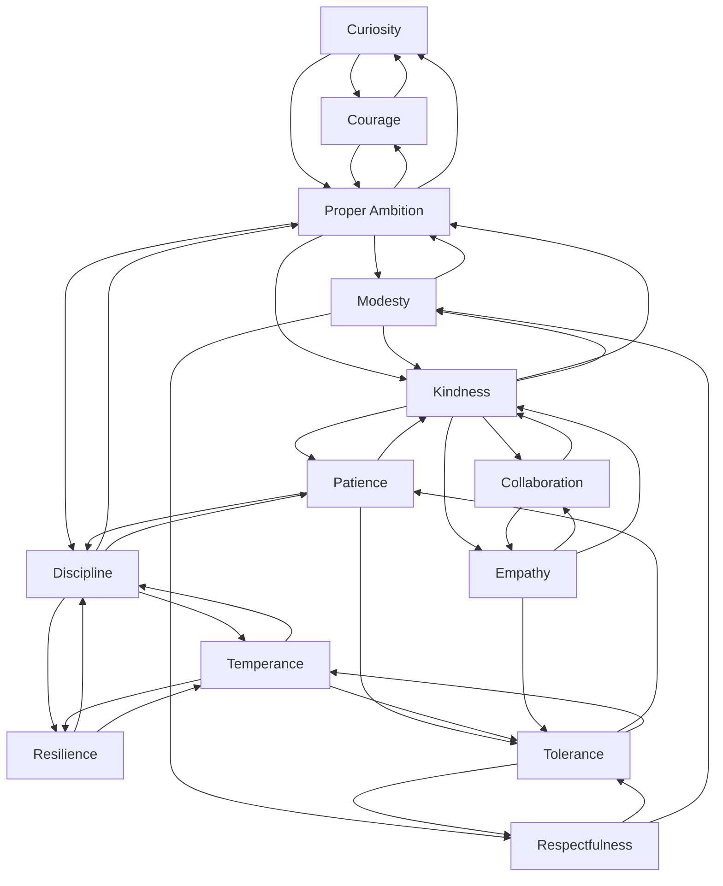
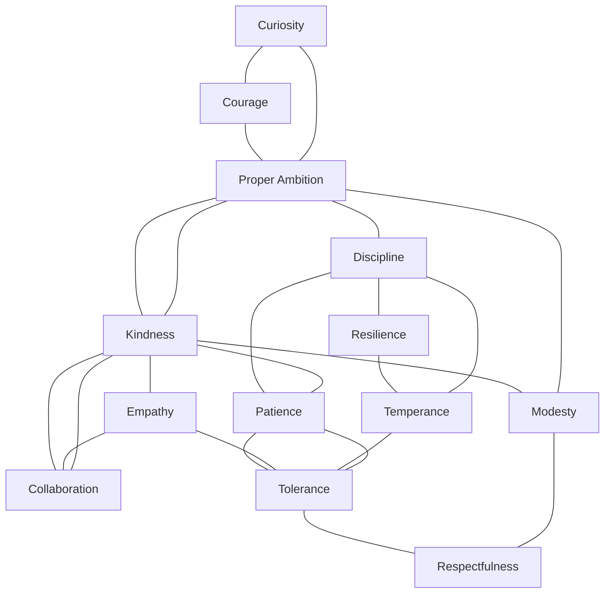

# Quest Virtue Combinations — Planning Map

Each quest has **one dominant virtue**. The dominant virtue determines which other virtues can appear in that quest. This document maps every dominant virtue to its allowed companion virtues.

---

## Graph: dominant virtue → allowed companions

Edges go **from** a dominant virtue **to** virtues that may appear as companions in that quest.

---

## Node graph: virtue relationship network

This shows the **virtues as a network**. An edge means “these two virtues can coexist in a quest together” (ignoring direction / dominance).

---

## Virtue combination map

| Dominant virtue   | Possible companion virtues                          |
|-------------------|-----------------------------------------------------|
| **Curiosity**     | Courage, Proper Ambition                            |
| **Courage**       | Curiosity, Proper Ambition                          |
| **Proper Ambition** | Modesty, Kindness, Discipline, Courage, Curiosity |
| **Kindness**      | Proper Ambition, Patience, Modesty, Collaboration, Empathy |
| **Modesty**       | Proper Ambition, Kindness, Respectfulness           |
| **Discipline**    | Proper Ambition, Patience, Temperance, Resilience   |
| **Resilience**    | Discipline, Temperance                              |
| **Patience**      | Kindness, Discipline, Tolerance                     |
| **Temperance**    | Discipline, Resilience, Tolerance                   |
| **Empathy**       | Collaboration, Tolerance, Kindness                  |
| **Collaboration** | Empathy, Kindness                                    |
| **Tolerance**     | Patience, Temperance, Respectfulness                |
| **Respectfulness** | Tolerance, Modesty                                |

---

## By dominant virtue (detail)

### Curiosity
- **Companions:** Courage, Proper Ambition  
- *Example focus:* Exploring, learning, asking questions while acting with courage or healthy ambition.

### Courage
- **Companions:** Curiosity, Proper Ambition  
- *Example focus:* Facing fear, taking risks, supported by curiosity or proper ambition.

### Proper Ambition
- **Companions:** Modesty, Kindness, Discipline, Courage, Curiosity  
- *Example focus:* Aiming high in a balanced way, with modesty, kindness, discipline, courage, or curiosity.

### Kindness
- **Companions:** Proper Ambition, Patience, Modesty, Collaboration, Empathy  
- *Example focus:* Caring for others, with ambition, patience, modesty, collaboration, or empathy.

### Modesty
- **Companions:** Proper Ambition, Kindness, Respectfulness  
- *Example focus:* Humility and realistic self-view, with ambition, kindness, or respect.

### Discipline
- **Companions:** Proper Ambition, Patience, Temperance, Resilience  
- *Example focus:* Consistency and self-control, with ambition, patience, temperance, or resilience.

### Resilience
- **Companions:** Discipline, Temperance  
- *Example focus:* Bouncing back and enduring, with discipline or temperance.

### Patience
- **Companions:** Kindness, Discipline, Tolerance  
- *Example focus:* Waiting and pacing, with kindness, discipline, or tolerance.

### Temperance
- **Companions:** Discipline, Resilience, Tolerance  
- *Example focus:* Balance and moderation, with discipline, resilience, or tolerance.

### Empathy
- **Companions:** Collaboration, Tolerance, Kindness  
- *Example focus:* Understanding others, with collaboration, tolerance, or kindness.

### Collaboration
- **Companions:** Empathy, Kindness  
- *Example focus:** Working with others, with empathy or kindness.

### Tolerance
- **Companions:** Patience, Temperance, Respectfulness  
- *Example focus:* Accepting differences, with patience, temperance, or respect.

### Respectfulness
- **Companions:** Tolerance, Modesty  
- *Example focus:* Honoring others and context, with tolerance or modesty.

---

## Quick reference: companion count

| Dominant virtue   | # companions |
|-------------------|--------------|
| Curiosity         | 2            |
| Courage           | 2            |
| Resilience        | 2            |
| Collaboration     | 2            |
| Respectfulness    | 2            |
| Modesty           | 3            |
| Empathy           | 3            |
| Patience          | 3            |
| Temperance        | 3            |
| Tolerance         | 3            |
| Kindness          | 5            |
| Discipline        | 4            |
| Proper Ambition   | 5            |

---

## Design note

- **Dominant virtue** = primary theme of the quest (one per quest).  
- **Companion virtues** = secondary themes that are allowed to appear in that quest.  
- When generating or tagging quests, pick one dominant virtue, then optionally one or more companions from its row in the map.

---

## Sample quests by dominant virtue

Each virtue below has **3 example quests**.  
- Each quest lists its **dominant virtue**.  
- Some quests have **no secondary virtues**, others show 1–2 companions from the allowed list.  
- **Difficulty** (Easy / Medium / Hard) and **virtue points** vary by quest: dominant virtue is weighted higher; secondaries receive fewer points. Totals and splits differ per quest.
- **Point ranges:** Minimum per virtue is 1. Easy quests ≈ 4–7 total (dominant only) or slightly more with secondaries; Medium ≈ 8–13; Hard ≈ 12–18. Secondary virtues typically get 1–5 points each.

### Curiosity (dominant)
1. **Quest:** Spend 30 minutes exploring a topic you know almost nothing about and write 5 surprising things you learned.  
   - **Secondary virtues:** *(none)*  
   - **Difficulty:** Easy · **Points:** Curiosity 6
2. **Quest:** Ask 5 genuine, open-ended questions in conversations today and capture 3 insights that changed how you see something.  
   - **Secondary virtues:** Courage  
   - **Difficulty:** Medium · **Points:** Curiosity 8, Courage 2
3. **Quest:** Pick a long-term goal and research 3 unconventional ways others have pursued it, summarizing pros and cons of each path.  
   - **Secondary virtues:** Proper Ambition  
   - **Difficulty:** Hard · **Points:** Curiosity 12, Proper Ambition 4

### Courage (dominant)
1. **Quest:** Do one thing today that scares you slightly but is clearly safe and meaningful (e.g., share an honest opinion, start a hard task) and journal the outcome.  
   - **Secondary virtues:** *(none)*  
   - **Difficulty:** Easy · **Points:** Courage 5
2. **Quest:** Initiate a vulnerable conversation you have been avoiding and stay present for at least 10 minutes, even if it feels uncomfortable.  
   - **Secondary virtues:** Curiosity  
   - **Difficulty:** Hard · **Points:** Courage 14, Curiosity 3
3. **Quest:** Take a bold step toward a goal (send an application, publish something, ask for feedback) and record what you learned regardless of the result.  
   - **Secondary virtues:** Proper Ambition  
   - **Difficulty:** Medium · **Points:** Courage 9, Proper Ambition 3

### Proper Ambition (dominant)
1. **Quest:** Define a 6–12 month goal and break it into weekly checkpoints, making sure each step feels demanding but realistic.  
   - **Secondary virtues:** *(none)*  
   - **Difficulty:** Medium · **Points:** Proper Ambition 10
2. **Quest:** Share your main ambition with someone you trust and invite them to challenge it, then revise your goal to keep it both bold and grounded.  
   - **Secondary virtues:** Modesty  
   - **Difficulty:** Hard · **Points:** Proper Ambition 13, Modesty 5
3. **Quest:** Design a 7-day routine that moves you measurably closer to your ambition and follow it for 3 days as an experiment.  
   - **Secondary virtues:** Discipline, Kindness  
   - **Difficulty:** Hard · **Points:** Proper Ambition 12, Discipline 3, Kindness 1

### Kindness (dominant)
1. **Quest:** Perform 3 small, invisible acts of kindness today that no one will trace back to you.  
   - **Secondary virtues:** *(none)*  
   - **Difficulty:** Easy · **Points:** Kindness 4
2. **Quest:** Identify someone who seems stressed or isolated and offer 15 minutes of undistracted, nonjudgmental listening.  
   - **Secondary virtues:** Empathy  
   - **Difficulty:** Medium · **Points:** Kindness 9, Empathy 4
3. **Quest:** Support someone else’s goal (feedback, encouragement, a practical favor) in a way that costs you some effort but feels genuinely generous.  
   - **Secondary virtues:** Collaboration, Proper Ambition  
   - **Difficulty:** Hard · **Points:** Kindness 11, Collaboration 2, Proper Ambition 2

### Modesty (dominant)
1. **Quest:** In your next group setting, deliberately speak once and then spend the rest of the time amplifying others’ ideas instead of your own.  
   - **Secondary virtues:** Respectfulness  
   - **Difficulty:** Medium · **Points:** Modesty 8, Respectfulness 2
2. **Quest:** List 5 strengths and 5 weaknesses honestly, then share one weakness with someone you trust without defending or justifying it.  
   - **Secondary virtues:** *(none)*  
   - **Difficulty:** Hard · **Points:** Modesty 12
3. **Quest:** When you receive praise today, accept it briefly and then highlight contributions from at least one other person.  
   - **Secondary virtues:** Kindness  
   - **Difficulty:** Easy · **Points:** Modesty 7, Kindness 1

### Discipline (dominant)
1. **Quest:** Choose one small habit (e.g., 10 minutes of reading, a short walk, tidying a space) and execute it at the same time 3 days in a row.  
   - **Secondary virtues:** *(none)*  
   - **Difficulty:** Easy · **Points:** Discipline 7
2. **Quest:** Block 60–90 minutes for a focused work session, remove distractions, and stick with a single task until the timer ends.  
   - **Secondary virtues:** Patience  
   - **Difficulty:** Medium · **Points:** Discipline 10, Patience 3
3. **Quest:** Identify one overindulgent behavior (scrolling, snacking, etc.) and set a clear limit for today, keeping a simple log of urges and choices.  
   - **Secondary virtues:** Temperance, Resilience  
   - **Difficulty:** Hard · **Points:** Discipline 13, Temperance 2, Resilience 1

### Resilience (dominant)
1. **Quest:** Revisit a recent setback and write a short story from the perspective of “future you” who has grown because of it.  
   - **Secondary virtues:** *(none)*  
   - **Difficulty:** Easy · **Points:** Resilience 6
2. **Quest:** Return to a project you previously abandoned and spend at least 25 minutes moving it one clear step forward.  
   - **Secondary virtues:** Discipline  
   - **Difficulty:** Hard · **Points:** Resilience 14, Discipline 4
3. **Quest:** When something goes wrong today, consciously name one thing you still control and take a small, constructive action based on it.  
   - **Secondary virtues:** Temperance  
   - **Difficulty:** Medium · **Points:** Resilience 9, Temperance 2

### Patience (dominant)
1. **Quest:** Choose one everyday delay (a line, traffic, loading screen) and use it as a cue to practice 10 slow breaths instead of reaching for your phone.  
   - **Secondary virtues:** *(none)*  
   - **Difficulty:** Easy · **Points:** Patience 5
2. **Quest:** Work on a task that normally frustrates you for 20 uninterrupted minutes, focusing on steady progress rather than speed.  
   - **Secondary virtues:** Discipline  
   - **Difficulty:** Medium · **Points:** Patience 8, Discipline 3
3. **Quest:** In one conversation today, wait 3 full seconds after someone finishes speaking before you respond, and notice what changes.  
   - **Secondary virtues:** Tolerance, Kindness  
   - **Difficulty:** Hard · **Points:** Patience 12, Tolerance 2, Kindness 1

### Temperance (dominant)
1. **Quest:** Pick one area of excess (food, media, spending, etc.) and intentionally reduce it by 25% for today, reflecting on how it feels.  
   - **Secondary virtues:** *(none)*  
   - **Difficulty:** Easy · **Points:** Temperance 6
2. **Quest:** Plan your next 24 hours with simple boundaries around work, rest, and leisure, and follow them as closely as you can.  
   - **Secondary virtues:** Discipline  
   - **Difficulty:** Medium · **Points:** Temperance 11, Discipline 3
3. **Quest:** Before accepting or declining any invitation today, pause and ask whether it supports your longer-term balance and priorities.  
   - **Secondary virtues:** Resilience, Tolerance  
   - **Difficulty:** Hard · **Points:** Temperance 13, Resilience 2, Tolerance 2

### Empathy (dominant)
1. **Quest:** Choose one person and write a short paragraph imagining their current worries, hopes, and pressures from their point of view.  
   - **Secondary virtues:** *(none)*  
   - **Difficulty:** Easy · **Points:** Empathy 7
2. **Quest:** In your next disagreement, restate the other person’s view in your own words and ask if they feel accurately understood before replying.  
   - **Secondary virtues:** Tolerance  
   - **Difficulty:** Hard · **Points:** Empathy 13, Tolerance 3
3. **Quest:** Reach out to someone you haven’t spoken to in a while and ask 3 questions about what life has really been like for them recently.  
   - **Secondary virtues:** Collaboration, Kindness  
   - **Difficulty:** Medium · **Points:** Empathy 10, Collaboration 2, Kindness 1

### Collaboration (dominant)
1. **Quest:** Invite someone to co-create or co-decide something with you (a plan, design, schedule) and genuinely incorporate their ideas.  
   - **Secondary virtues:** *(none)*  
   - **Difficulty:** Medium · **Points:** Collaboration 9
2. **Quest:** During a group task, explicitly clarify roles and shared goals, and check in once to see how everyone is feeling about the process.  
   - **Secondary virtues:** Empathy  
   - **Difficulty:** Easy · **Points:** Collaboration 6, Empathy 2
3. **Quest:** Ask a teammate or friend how you could be a better collaborator for them this week and act on one concrete suggestion.  
   - **Secondary virtues:** Kindness  
   - **Difficulty:** Hard · **Points:** Collaboration 12, Kindness 4

### Tolerance (dominant)
1. **Quest:** Read or watch a thoughtful piece from a perspective you typically disagree with and list 3 points you can still respect or understand.  
   - **Secondary virtues:** *(none)*  
   - **Difficulty:** Easy · **Points:** Tolerance 6
2. **Quest:** When someone does something that annoys you today, silently generate one generous explanation before reacting.  
   - **Secondary virtues:** Patience  
   - **Difficulty:** Medium · **Points:** Tolerance 9, Patience 2
3. **Quest:** Have a calm conversation with someone who differs from you on a value or preference, focusing only on understanding, not persuading.  
   - **Secondary virtues:** Temperance, Respectfulness  
   - **Difficulty:** Hard · **Points:** Tolerance 14, Temperance 2, Respectfulness 2

### Respectfulness (dominant)
1. **Quest:** Choose a shared physical or digital space you use with others and spend 15 minutes improving it in a way that honors everyone’s needs.  
   - **Secondary virtues:** *(none)*  
   - **Difficulty:** Easy · **Points:** Respectfulness 5
2. **Quest:** In your next conversation, avoid interrupting entirely and instead signal that you value the other person’s time and attention.  
   - **Secondary virtues:** Modesty  
   - **Difficulty:** Medium · **Points:** Respectfulness 8, Modesty 3
3. **Quest:** Identify one rule, norm, or tradition you usually ignore, and consciously follow it today as a way of honoring the people around it benefits.  
   - **Secondary virtues:** Tolerance  
   - **Difficulty:** Hard · **Points:** Respectfulness 13, Tolerance 3
